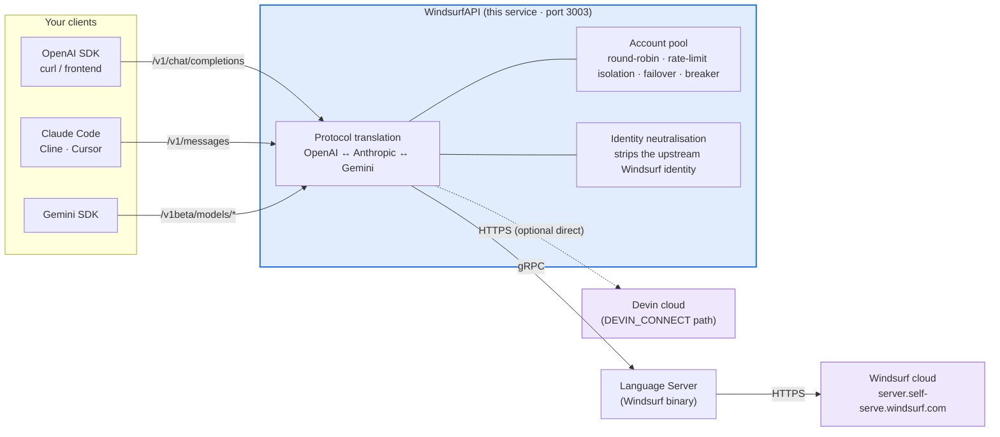
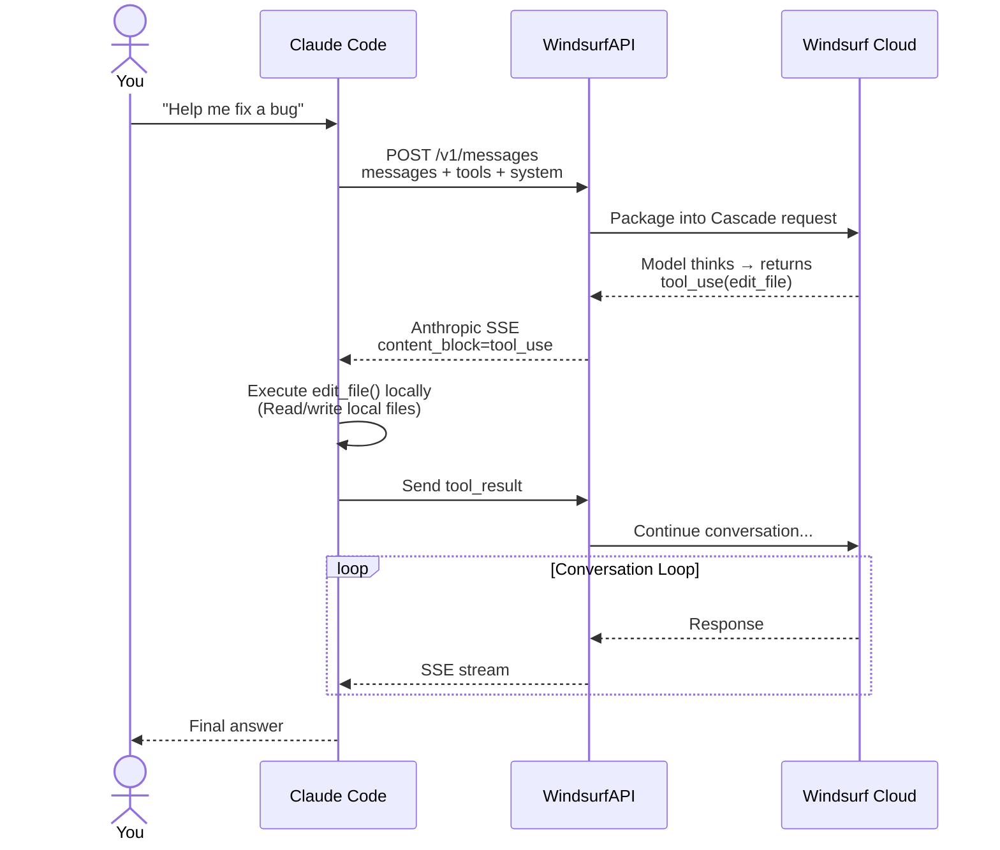
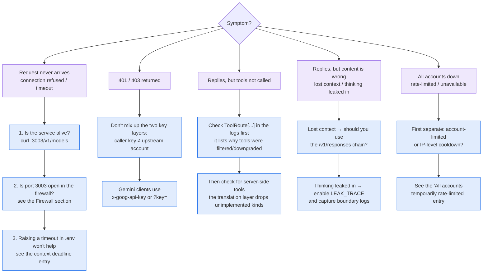

<p align="center">
  
</p>

# WindsurfAPI · DevinAPI

> Turn Windsurf / Devin's 100+ AI models (Claude, GPT, Gemini, DeepSeek, Kimi, GLM, SWE…) into OpenAI / Anthropic / Gemini standard APIs. Zero npm runtime dependencies.

> **History Ledger** · Every commit laid out: 1311 commits, 191 releases, 72 PRs, 179 issues — timeline, contributor analysis, Git tree (vertical / horizontal / ring), and a full account of every mistake along the way. [**Open the interactive ledger**](https://dwgx.github.io/WindsurfAPI/HISTORY-LEDGER-VIZ.html) (zero-dependency, pure vanilla).


<p align="center">
  <a href="https://github.com/dwgx/WindsurfAPI/stargazers"></a>&nbsp;
  <a href="https://github.com/dwgx/WindsurfAPI/blob/master/LICENSE"></a>&nbsp;
  <a href="https://github.com/dwgx/WindsurfAPI/releases/latest"></a>&nbsp;
  <a href="https://github.com/dwgx/WindsurfAPI/actions/workflows/ci.yml"></a>&nbsp;
  <a href="https://dwgx.github.io/WindsurfAPI/"></a>&nbsp;
  <a href="https://github.com/dwgx"></a>
  &nbsp;·&nbsp;
  <a href="README.md">中文/简体中文</a>
</p>

# Notice

> **If you haven't starred and followed**: commercial use, resale, paid deployment, hosting as a backend for public services, or reselling as a relay service is strictly prohibited.
> **If you have starred and followed**: go ahead, I'll look the other way.
>
> The code itself is MIT-licensed (see [LICENSE](LICENSE)); the above is the author's personal stance.

---

Turns [Windsurf](https://windsurf.com) (formerly Codeium, now Devin Desktop)'s AI models into **three standard, compatible APIs**:

- `POST /v1/chat/completions` — **OpenAI Compatible** for any OpenAI SDK.
- `POST /v1/completions` — **OpenAI legacy Completions** (non-stream; `prompt` becomes one user turn — stream via chat).
- `POST /v1/responses` — **OpenAI Responses Compatible** (plus `GET` / `DELETE /v1/responses/{id}` to retrieve or drop a stored response — these need an identity header, see below).
- `POST /v1/messages` — **Anthropic Compatible** for direct connection with Claude Code / Cline / Cursor.
- `POST /v1beta/models/*` — **Gemini Compatible** for direct Gemini SDK use.

**100+ Models**: Claude 4.5/4.6/Opus 4.7/5 · GPT-5/5.1/5.2/5.4/5.5/5.6-Luna series · Gemini 2.5/3.0/3.1 · Grok · Qwen · Kimi K2.x · GLM 4.7/5/5.1/5.2 · MiniMax · SWE 1.5/1.6/1.7 · Arena, etc. Zero npm dependencies, pure Node.js.

<sub>Keywords: Windsurf reverse proxy · Devin API · Claude Code proxy · Cursor mirror · free Claude/GPT/Gemini · Codeium API · OpenAI-compatible endpoint · self-hosted LLM gateway</sub>

<p align="center">
  <a href="#what-is-it-doing">How it works</a> ·
  <a href="#quick-start">Quick start</a> ·
  <a href="#how-to-use-with-claude-code--cline--cursor">Client setup</a> ·
  <a href="docs/ENV-SWITCHES.md">Env switches</a> ·
  <a href="docs/">All docs</a> ·
  <a href="README.md">中文</a>
</p>

## What is it doing?



**What it does**:
1. An HTTP service (port 3003) exposing both OpenAI and Anthropic APIs simultaneously.
2. Translates requests into Windsurf's internal gRPC protocol and sends them to the Windsurf cloud via a local Language Server.
3. Manages an account pool with automatic round-robin, rate limiting, and failover.
4. Strips the upstream Windsurf identity before returning, making the model identify as "I am Claude Opus 4.6, developed by Anthropic."

## How to use with Claude Code / Cline / Cursor

The model itself does **not** operate on files — file operations are executed locally by the IDE Agent client (Claude Code, Cline, etc.):



**Key Point**: WindsurfAPI is only responsible for **passing** `tool_use` / `tool_result`. The client CLI is what actually modifies the files.

## Quick Start

### One-Click Deployment

```bash
git clone https://github.com/dwgx/WindsurfAPI.git
cd WindsurfAPI
bash setup.sh          # Create directories · Set permissions · Generate .env
node src/index.js
```

Dashboard: `http://YOUR_IP:3003/dashboard`

### Docker Deployment

```bash
cp .env.example .env
# Empty API_KEY / DASHBOARD_PASSWORD is fail-closed (compose binds 0.0.0.0).
# Compose defaults to DEVIN_CONNECT=1 — no Language Server, no LS auto-download.
# LS install on first boot only runs if you turn DEVIN_CONNECT off (Cascade).

docker compose up -d --build
docker compose logs -f
```

Default mounts:

- `./.docker-data/data`: persisted `accounts.json`, `proxy.json`, `stats.json`, `runtime-config.json`, `model-access.json`, and `logs/`
- `./.docker-data/opt/windsurf`: Language Server binary and its data directory
- `./.docker-data/tmp/windsurf-workspace`: temporary workspace

If you want a different persistence location, set `DATA_DIR` in `.env`. The Docker setup defaults it to `/data`.

### One-Click Update

To pull the latest fixes after deployment, just run one command:

```bash
cd ~/WindsurfAPI && bash update.sh
```

`update.sh` does: `git pull` → updates the LS binary via `install-ls.sh` → stops PM2 → kills any residual process on port 3003 → restarts → health check.

If you are using our public instances (`skiapi.dev`, etc.), you don't need to do anything; we've already pushed the updates.

### Manual Installation

```bash
git clone https://github.com/dwgx/WindsurfAPI.git
cd WindsurfAPI

# Language Server binary — auto-detects Linux/macOS, one-click download + chmod
bash install-ls.sh

# Download chain: WindsurfAPI release → public LS mirror
#   https://github.com/dwgx/windsurf-ls-release/releases/latest/download
# → Exafunction/codeium fallback. For a private mirror or rollback, set:
#   WINDSURFAPI_LS_RELEASE=https://github.com/<owner>/<repo>/releases/latest/download bash install-ls.sh

# Default install paths:
#   Linux x64:           /opt/windsurf/language_server_linux_x64
#   Linux arm64:         /opt/windsurf/language_server_linux_arm
#   macOS Apple Silicon: $HOME/.windsurf/language_server_macos_arm
#   macOS Intel:         $HOME/.windsurf/language_server_macos_x64

# Or use a local binary you already have:
#   bash install-ls.sh /path/to/language_server_linux_x64
# Or specify a custom URL:
#   bash install-ls.sh --url https://example.com/language_server_linux_x64

# ⚠️ LS binary is old / want a different source?
# The default download chain now uses the dwgx/windsurf-ls-release public mirror.
# If the mirror does not cover your platform yet, copy the LS binary out of
# the Windsurf desktop app bundle:
#
#   macOS:   "$HOME/Library/Application Support/Windsurf/resources/app/extensions/windsurf/bin/language_server_macos_arm"
#   Linux:   "$HOME/.windsurf/bin/language_server_linux_x64"
#            or /opt/Windsurf/resources/app/extensions/windsurf/bin/language_server_linux_x64
#   Windows: %APPDATA%\Windsurf\bin\language_server_windows_x64.exe
#
#   # Install from the local desktop copy:
#   bash install-ls.sh /path/to/language_server_linux_x64
#
# Note: swapping the LS binary does not change /v1/models.
# The catalog is fetched by the proxy over HTTPS (GetCascadeModelConfigs /
# GetCliModelConfigs). ideVersion is hardcoded in src/windsurf-api.js and is
# not read from the binary — so the listing depends on what upstream grants
# this account. A missing new model is an entitlement gap, not a stale file.

cat > .env << 'EOF'
PORT=3003
# Empty API_KEY is fail-closed (401) even on localhost.
# Local open access: WINDSURFAPI_ALLOW_UNAUTHENTICATED=1 and HOST=127.0.0.1
API_KEY=
DEFAULT_MODEL=claude-sonnet-4.6
MAX_TOKENS=8192
LOG_LEVEL=info
LS_BINARY_PATH=/opt/windsurf/language_server_linux_x64
LS_DATA_DIR=/opt/windsurf/data
LS_PORT=42100
# Empty DASHBOARD_PASSWORD is fail-closed. Local open panel: DASHBOARD_ALLOW_NO_AUTH=1
DASHBOARD_PASSWORD=
EOF

# For a local macOS run, use the LS_BINARY_PATH printed by install-ls.sh
# and set LS_DATA_DIR to a user-writable path such as /Users/you/.windsurf/data.

# Note: Inline comments are supported in .env for unquoted values:
#   PORT=3003  # Service port
# Quoted values preserve everything inside the quotes.

node src/index.js
```

## Add Accounts

After the service is running, you need to add Windsurf accounts. There are three ways:

**Method 1: Dashboard One-Click Login (Recommended)**

Open `http://YOUR_IP:3003/dashboard` → Login to get token → Click **Sign in with Google** or **Sign in with GitHub** (OAuth popup) or fill in email/password directly. All methods will automatically add the account to the pool.

**Method 2: Token (Works with any login method)**

Go to [windsurf.com/show-auth-token](https://windsurf.com/show-auth-token) to copy your token:

```bash
curl -X POST http://localhost:3003/auth/login \
  -H "Content-Type: application/json" \
  -d '{"token": "YOUR_TOKEN"}'
```

**Method 3: Batch**

```bash
curl -X POST http://localhost:3003/auth/login \
  -H "Content-Type: application/json" \
  -d '{"accounts": [{"token": "t1"}, {"token": "t2"}]}'
```

## Usage Examples

### OpenAI Format (Python / JS / curl)

```python
from openai import OpenAI
client = OpenAI(base_url="http://YOUR_IP:3003/v1", api_key="YOUR_API_KEY")
r = client.chat.completions.create(
    model="claude-sonnet-4.6",
    messages=[{"role": "user", "content": "Hello"}]
)
print(r.choices[0].message.content)
```

### Anthropic Format (Directly with Claude Code)

```bash
export ANTHROPIC_BASE_URL=http://YOUR_IP:3003
export ANTHROPIC_API_KEY=YOUR_API_KEY
claude                # Use Claude Code as usual
```

```bash
# Raw curl test
curl http://localhost:3003/v1/messages \
  -H "Authorization: Bearer YOUR_KEY" \
  -H "anthropic-version: 2023-06-01" \
  -d '{"model":"claude-opus-4.6","max_tokens":100,"messages":[{"role":"user","content":"Hello"}]}'
```

### Cline / Cursor / Aider

In your client's settings for **Custom OpenAI Compatible**:
- Base URL: `http://YOUR_IP:3003/v1`
- API Key: YOUR_API_KEY
- Model: Choose any supported model.

> **Cursor users**: Cursor's client-side whitelist blocks model names containing `claude` (the request never reaches the backend). Use these aliases instead:
>
> | Type in Cursor | Actual model |
> |---|---|
> | `opus-4.6` | claude-opus-4.6 |
> | `sonnet-4.6` | claude-sonnet-4.6 |
> | `opus-4.7` | claude-opus-4-7-medium |
> | `ws-opus` | claude-opus-4.6 |
> | `ws-sonnet` | claude-sonnet-4.6 |
>
> GPT / Gemini / DeepSeek models are not affected by Cursor's filter — use their original names.

## Environment Variables

| Variable | Default | Description |
|---|---|---|
| `PORT` | `3003` | Service port |
| `API_KEY` | empty | Caller key. Empty is fail-closed (401) even on localhost. Local open access requires `WINDSURFAPI_ALLOW_UNAUTHENTICATED=1` on a local bind. |
| `WINDSURFAPI_ALLOW_UNAUTHENTICATED` | off | Allow empty `API_KEY` on a local bind. Default off. Ignored on a public bind. |
| `DATA_DIR` | project root | Directory for persisted JSON state and `logs/`. Docker deployments should usually use `/data`. |
| `CODEIUM_API_KEY` | empty | Direct API key from Windsurf (alternative to token-based auth). |
| `CODEIUM_AUTH_TOKEN` | empty | Token from [windsurf.com/show-auth-token](https://windsurf.com/show-auth-token). |
| `CODEIUM_EMAIL` | empty | Email for Windsurf account authentication. |
| `CODEIUM_PASSWORD` | empty | Password for Windsurf account authentication. |
| `CODEIUM_API_URL` | `https://server.self-serve.windsurf.com` | Windsurf cloud API endpoint. |
| `DEFAULT_MODEL` | `claude-sonnet-4.6` | The model to use if `model` is not specified. Must be a name the active backend can resolve. Unmapped Connect names return 400 `model_not_found` unless `WINDSURFAPI_STRICT_MODEL=0` (legacy silent degrade to the free selector). |
| `MAX_TOKENS` | `8192` | Default maximum number of response tokens. |
| `LOG_LEVEL` | `info` | debug / info / warn / error |
| `WINDSURFAPI_IGNORE_CLOUD_FILTER` | `0` | On the Cascade transport, after per-account cloud catalogs sync, pool listings show their union and routing enforces each selected account's catalog. Set to `1` to restore the full static catalog. Missing, empty, or failed catalog syncs fail open. `DEVIN_CONNECT` uses its separate selector catalog. |
| `LS_BINARY_PATH` | `/opt/windsurf/language_server_linux_x64` | Path to the LS binary. |
| `LS_PORT` | `42100` | LS gRPC port. |
| `LS_DATA_DIR` | Linux: `/opt/windsurf/data`; macOS: `~/.windsurf/data` | Per-proxy LS data directory root. |
| `LS_MAX_INSTANCES` | adaptive, max `20` | Maximum LS pool size. The adaptive default reserves at least one non-default proxy slot on small hosts. |
| `LS_SPAWN_MIN_AVAILABLE_BYTES` | `700MB` | Minimum available memory required before starting a new non-default LS. |
| `LS_PREWARM_DEFAULT` | `1` | Set to `0` to skip startup default-LS prewarm and start LS lazily on first request. Useful for low-memory, all-proxy pools. |
| `LS_PREWARM_PROXIES` | `0` | Set to `1` to prewarm all proxy LS instances on startup. Scheduled probes and predictive prewarm only reuse idle resident LS instances. |
| `LS_PREWARM_ON_ACCOUNT_ADD` | `0` | Set to `1` to prewarm LS immediately after dashboard/import/OAuth account add. Default avoids memory spikes during bulk import. |
| `WINDSURFAPI_NATIVE_TOOL_BRIDGE` | empty | Lab/remote-execution opt-in only. `all_mapped` enables native bridge only when every declared function tool is allowlisted and mappable; `1` enables partition mode for mapped subsets. Do not treat this as a general fix for local IDE tools. |
| `WINDSURFAPI_NATIVE_TOOL_BRIDGE_TOOLS` | `Bash/shell_command/run_command` families | Tool allowlist for native bridge. The default intentionally contains only the command path. `Read` / `Grep` / `Glob` / `WebSearch` / `WebFetch` require explicit allowlisting plus model/account/API-key gates and are still protocol-lab scope, not production defaults. |
| `WINDSURFAPI_NATIVE_TOOL_BRIDGE_MODELS` / `PROVIDERS` / `ROUTES` / `CALLERS` / `ACCOUNTS` / `API_KEYS` | empty | Optional native-bridge gray gates. Empty means unrestricted; when set, the request must match. `ACCOUNTS` accepts upstream account id/email. `API_KEYS` matches caller API keys without passing plaintext tokens into chat logic. |
| `WINDSURFAPI_NATIVE_TOOL_BRIDGE_OFF` | empty | Set to `1` to force native bridge off. |
| `WINDSURFAPI_SPECIAL_AGENT_BACKEND` | empty | Optional lab-only special-agent backend. Set `devin-cli` to test `swe-1.6`, `swe-1.6-fast`, `adaptive`, and `arena-*` through Devin CLI instead of direct Cascade. This is not a normal catalog-model fix. |
| `ORCAROUTER_API_KEY` | empty | Enables the OrcaRouter third-party gateway provider. When set, `orcarouter/*` models (e.g. `orcarouter/fusion-mini`) are forwarded verbatim to `https://api.orcarouter.ai/v1` and do not consume Windsurf account-pool quota. See the "Supported Models" section. |
| `DEVIN_CLI_PATH` | `devin` | Devin CLI executable path. Docker/macOS deployments must install or mount it themselves. |
| `DEVIN_CLI_MODE` | `print` | `print` uses conservative `devin -p`; `acp` is an experimental ACP stdio backend using upstream Windsurf account-pool apiKeys. |
| `DEVIN_MAX_PROCS` | `1` | Maximum concurrent Devin CLI processes. |
| `DASHBOARD_PASSWORD` | empty | Dashboard password. Empty is fail-closed even on localhost. Local open panel requires `DASHBOARD_ALLOW_NO_AUTH=1`. |
| `ALLOW_PRIVATE_PROXY_HOSTS` | empty | Set to `1` to allow private/internal IPs (e.g., `192.168.x.x`, `10.x.x.x`) in proxy tests and login. Leave empty to only allow public addresses (default). |
| `CASCADE_REUSE_STRICT` | `0` | Set to `1` for strict conversation reuse mode (waits for same fingerprint). |
| `CASCADE_REUSE_STRICT_RETRY_MS` | `60000` | Retry delay in ms for strict reuse mode. |
| `CASCADE_REUSE_HASH_SYSTEM` | `1` | System messages are hashed into the conversation reuse fingerprint by default. Set to `0` to opt out — raises the reuse hit rate for callers whose system prompt drifts every turn (Claude Code with `cwd` snapshots), at the cost of reuse isolation: two requests with different system prompts can then share one pooled conversation. |
| `CASCADE_REUSE_BY_CALLER` | `0` | Set to `1` to enable caller-based fallback reuse. When fingerprint misses, falls back to the latest cascade for the same caller+model. Best for single-user Claude Code setups. |
| `CASCADE_POOL_MAX` | `500` | Max conversation pool entries. Set to `1`–`5` for single-user setups to minimize resource usage. |
| `STICKY_SESSION_ENABLED` | `0` | Set to `1` to pin each conversation to one upstream account. Strongly recommended on DEVIN_CONNECT: upstream prompt caches are per-account and a cache write costs ~5.6× a read (`devin-connect.js` 17.8%-of-miss calibration), so without pinning every turn rotates accounts and re-writes the whole context. Requires a per-user signal on the caller (`user` / `safety_identifier` / `prompt_cache_key` / Claude Code `metadata.user_id`); single-user self-hosts without one set `WINDSURFAPI_SINGLE_TENANT_CACHE=1`. Observe via the `sticky` field of `/dashboard/api/connect-metrics`. |
| `STICKY_SESSION_TTL_MS` | `1800000` | Binding TTL (30 min); active conversations auto-renew each turn. |
| `STICKY_SESSION_MAX` | `10000` | Binding table cap, LRU-evicted. |
| `RESPONSE_STORE_ENABLED` | `1` | Responses API server-side conversation state. With it on, `previous_response_id` continues a conversation (the client sends only the new turn); set `0` and such requests get a 400, as do `GET`/`DELETE /v1/responses/{id}`. Scoped by callerKey. Retrieval and deletion use the same scope as chaining: another caller's id always 404s, without revealing whether it exists. **This row used to say "tenants cannot read each other's conversations", which overstated where the guarantee comes from** — the scope is not a secret. Behind one shared API key the callerKey is `api:{hash(apiKey)}:user:{hash(body.user)}`, and `user` is typically an email or account id, i.e. guessable. What actually prevents a cross-read is the **90 bits of entropy in the response id** (`resp_` + a dash-stripped UUIDv4 truncated to 24 hex chars — 96 bits of width less the version/variant bits that fall inside the slice). Measured: with the scope entirely correct but the id wrong, the lookup still returns not_found. So the isolation does hold, but it holds because you have to hit a 90-bit id — not because the scope separates tenants. Do not treat `user` as an access control. **Retrieval/deletion carry no request body, so the identity signal rides a header**: `GET /v1/responses/{id}` with `x-response-prompt-cache-key: <the value you sent on POST>`. All six scope signals work: `user` / `prompt_cache_key` / `safety_identifier` / `conversation` / `conversation_id` / `session_id`. **Header names replace underscores with hyphens** (`x-response-conversation-id`); the query fallback accepts either spelling (`?conversation_id=` and `?conversation-id=`, and likewise for the other multi-word signals). It must match the value used when the response was created, otherwise 404. **Send ONE scope signal and send it consistently** — supplying several different scope signals folds them all into a single identity, so adding one changes the derived key (pre-existing behaviour, not specific to the query channel). **Query strings are logged by reverse proxies, CDNs and browser history and `user` often contains PII — prefer the header.** |
| `RESPONSE_STORE_TTL_MS` | `3600000` | An **idle** timeout (1 hour), not a retention ceiling. It measures time since last access, and every successful `GET` refreshes that — so on its own, periodic reads keep an entry alive indefinitely. The absolute bound is the next row. |
| `RESPONSE_STORE_MAX_AGE_MS` | `86400000` | The **absolute** retention bound (24 hours), measured from when the entry was created and never refreshed by reads. The default sits well above a long agent session rather than close to the idle timeout: dropping a running loop's context mid-flight is a worse failure than retaining it longer, and total memory is already bounded by the byte and count caps. |
| `RESPONSE_STORE_MAX` | `2000` | Max stored conversations, LRU-evicted with a per-tenant fair share. |
| `RESPONSE_STORE_MAX_BYTES` | `128m` | Total byte budget for stored conversations (b/k/kb/m/mb/g/gb). The count caps bound cardinality, not memory — a realistic agent conversation measures ~167KB, so 2000 entries is ~327MB. Eviction triggers on whichever limit binds first. |
| `DEVIN_CONNECT_IMAGE_TAG` | `10` | DEVIN_CONNECT image-field tag. Defaults to repeated field `#10`, independently verified by the extracted Devin schema and a native SWE-1.7 capture; set `0` to stop emitting images. |
| `DEVIN_CONNECT_COLLAPSE_SYSTEM` | `0` | Set `1` to wrap system content in `<system>...</system>` and merge it, in order, into the next user message, avoiding the stricter upstream policy path on field `#2`. Default off; when tools require a non-empty field `#2`, only the existing benign placeholder remains there. |
| `DEVIN_CONNECT_CATALOG_TTL_MS` | `300000` | Successful DEVIN_CONNECT live-catalog TTL (5 minutes by default, 10-second minimum). Accounts sync independently; failed or empty responses keep the last-known-good catalog. |

The full list lives in [.env.example](.env.example); the table above covers the common ones.

## Enabling images / vision

The `DEVIN_CONNECT` backend now emits inline images using the native Devin wire by default:

```sh
# 10 is already the default; use only for an emergency rollback
DEVIN_CONNECT_IMAGE_TAG=0
```

Tag `10` has two independent sources of truth: the extracted Devin schema declares
`ChatMessagePrompt.images` as repeated `#10` and `ImageData` as `base64_data #1` /
`mime_type #2`; a native SWE-1.7 request attaches the image directly to a `source=USER`
message, receives `modelUid=swe-1-7`, and correctly identifies the macOS Dock, Sketch, QQ,
and WPS. The gateway therefore no longer invents an assistant `read` tool call, a synthetic
tool result, or a top-level `read` ToolDef, and it no longer rejects vision from a model merely
because its name starts with `swe-`.

Ordinary user images remain on their original user message; multiple images are repeated on that
same message. Images in a native tool result remain `source=TOOL_RESULT` and preserve the caller's
`tool_call_id #7`. Live catalog synchronization also decodes
`ClientModelConfig.supports_images #5` and exposes `supports_images` through `/v1/models` when
upstream explicitly supplies true or false. A missing field remains unknown rather than being
invented as false. Models carrying upstream `disabled #4` do not enter the live catalog.

`DEVIN_CONNECT_IMAGE_INNER_TAGS` can still override the inner `base64,mime` tags (default `1,2`)
as an emergency calibration surface for a future wire change. The synchronous builder does not
download remote `https://` image URLs; use data URLs/base64, or explicitly enable
`DEVIN_ACP_VISION=1` to route vision through a locally installed Devin CLI ACP transport.

## Dashboard Features

Open `http://YOUR_IP:3003/dashboard`:

| Panel | Features |
|---|---|
| **Overview** | Runtime status · Account pool · LS health · Success rate |
| **Login/Get Token** | Google / GitHub OAuth one-click login · Email/password login · **Test Proxy** button (tests egress IP) |
| **Account Management** | Add / Delete / Disable · Detect subscription level · Check balance · Ban models via blacklist |
| **Model Control** | Global model whitelist/blacklist |
| **Proxy Config** | Global or per-account HTTP / SOCKS5 proxy |
| **Logs** | Real-time SSE streaming · Filter by level · `turns=N chars=M` diagnostics per turn |
| **Stats & Analytics** | Time range 6h / 24h / 72h · Per-account dimensions · p50 / p95 latency |
| **Experimental** | Cascade conversation reuse · **Model Identity Injection (custom prompt per vendor)** |

## Supported Models

100+ static models in the main catalog plus dynamic cloud-side models added at startup via `mergeCloudModels`. On the Cascade transport, after per-account cloud catalogs sync, `GET /v1/models` and the Dashboard show the union available across active accounts, while routing applies the selected account's own catalog. `DEVIN_CONNECT` remains governed by its separate selector catalog. The full static catalog remains available on the [GitHub Pages model catalog](https://dwgx.github.io/WindsurfAPI/#models) (auto-generated from `src/models.js`).

<details>
<summary><b>Claude (Anthropic)</b> — 36 models</summary>

claude-3.5-sonnet / 3.7-sonnet / thinking · claude-4-sonnet / opus / thinking · claude-4.1-opus · claude-4.5-haiku / sonnet / opus · claude-sonnet-4.6 (incl. 1m / thinking / thinking-1m) · claude-opus-4.6 / thinking · **claude-opus-4.7-medium** · **claude-opus-4.8 series** (low / medium / high / xhigh / max + fast) · **claude-5-fable / claude-sonnet-5 / claude-opus-5 series** (low / medium / high / xhigh / max; opus-5 incl. fast)

</details>

<details>
<summary><b>GPT (OpenAI)</b> — 65 models</summary>

gpt-4o · gpt-4.1 · gpt-5 series (incl. medium / high / codex) · **gpt-5.1 series** (base / low / medium / high + fast + codex, all 6 variants) · **gpt-5.2 series** (none / low / medium / high / xhigh + fast + codex) · **gpt-5.4 series** (base / mini × low/medium/high/xhigh) · **gpt-5.5 series** (none / low / medium / high / xhigh + fast) · **gpt-5.6-luna series** (none / low / medium / high / xhigh) · o3 series (base / mini / pro) · o4-mini

</details>

<details>
<summary><b>Gemini (Google)</b> — 9 models</summary>

gemini-2.5-pro / flash · gemini-3.0-pro / flash (minimal / low / medium / high — 4 reasoning levels) · gemini-3.1-pro (low / high)

</details>

<details>
<summary><b>Open source / Chinese providers</b></summary>

**Kimi**: kimi-k2 / k2.5 / k2-6 / k2-7 · **GLM**: glm-4.7 / 5 / 5.1 / 5.2 · **Qwen**: qwen-3 · **Grok**: grok-3 / grok-3-mini-thinking / grok-code-fast-1 · **MiniMax**: minimax-m2.5

</details>

<details>
<summary><b>Windsurf in-house + Arena</b></summary>

swe-1.5 / 1.5-fast / 1.6 / 1.6-fast / 1.7 / 1.7-lightning · arena-fast · arena-smart

</details>

> **Free-account entitlements** typically include `gemini-2.5-flash`, `glm-4.7` / `glm-5` / `5.1`, `kimi-k2` / `k2.5` / `k2-6`, `qwen-3` and similar open-source models; Claude family, GPT family, and Opus / thinking variants require Pro. Each account's exact list shows up in the dashboard.
>
> **Tool-calling reliability (measured v2.0.82+):** Claude family is the most reliable (their training covered prompt-level tool protocols); GLM-4.7 / Kimi-K2.5 work for most cases via NLU fallback + optional retry-with-correction; GLM-5.1 is unreliable on the cascade backend (it often returns empty responses, no narration to recover from); GPT family is also limited because the cascade upstream doesn't carry `tools[]` schema. For Claude Code / Cline / Codex doing local tool calls, prefer `claude-haiku-4.5` or `claude-sonnet-4.6`.

<details>
<summary><b>OrcaRouter (OpenAI-compatible AI gateway) — third-party provider</b></summary>

[OrcaRouter](https://www.orcarouter.ai) is an OpenAI-compatible AI gateway. Like OpenRouter, it exposes a provider/model namespace across many models on one endpoint — but it also combines adaptive routing, automatic failover, zero-markup inference, observability, guardrails, and agent-tool governance behind that same endpoint. Adding it as a first-class provider here means setting `ORCAROUTER_API_KEY` and calling any `orcarouter/*` model (e.g. `orcarouter/fusion-mini`, `orcarouter/fusion`); requests are forwarded verbatim to `https://api.orcarouter.ai/v1` and do not consume Windsurf account-pool quota. Gateway-level, zero-trust security for AI agents runs on the same endpoint — screening every prompt/response and governing every tool call on a default-deny basis, with no application code changes.

- Config: set `ORCAROUTER_API_KEY=sk-orca-...` in `.env`.
- Model prefix: `orcarouter/<upstream-model-id>` — any id forwards (`GET /v1/models` lists the curated `orcarouter/free` / `fusion` / `fusion-flash` / `fusion-mini` / `auto`).
- Both streaming and non-streaming OpenAI-compatible responses are relayed.
- Discord: discord.gg/YEubt8enRA · X: https://x.com/OrcaRouter

</details>

### Language-Following for CJK Users

The service automatically detects Chinese, Japanese, or Korean characters in your messages and injects a language-following hint to ensure the model responds in the same language. This fixes the issue where Claude Code's large English system prompt would override the communication language.

## Architecture Highlights

- **Zero npm dependencies** Everything uses `node:*` built-ins · Protobuf is handcrafted (`src/proto.js`) · image codecs vendored (`src/vendor/`, BSD-3 jpeg-js + an original pure-Node PNG decoder) · download and run.
- **Account Pool + LS Pool** Each independent proxy gets its own LS instance, no mixing.
- **NO_TOOL Mode** `planner_mode=3` disables Cascade's built-in tool loop to prevent `/tmp/windsurf-workspace/` path leakage.
- **Three-layer sanitization** LS built-in tool result filtering · `<tool_call>` text parsing · Output path cleaning.
- **Real token counting** Fetches real `inputTokens` / `outputTokens` / `cacheRead` / `cacheWrite` from `CortexStepMetadata.model_usage`. `prompt_tokens` includes cacheWrite.

## PM2 Deployment

```bash
npm install -g pm2
pm2 start src/index.js --name windsurf-api
pm2 save && pm2 startup
```

**Do not** use `pm2 restart` (it can create zombie processes). Use the one-click update script `bash update.sh`.

## Firewall

```bash
# Ubuntu
ufw allow 3003/tcp

# CentOS
firewall-cmd --add-port=3003/tcp --permanent && firewall-cmd --reload
```

Remember to open port 3003 in your cloud provider's security group.

## Having Issues? Start Here

Search by **symptom** — no need to read the whole FAQ. This is a protocol-conversion gateway, so the first step of any investigation is always to figure out **which layer is broken**: the client, this gateway, or the upstream.



**The two easiest to trip over**:

| Symptom | Real cause |
|---|---|
| Raised the timeout in `.env` but `context deadline exceeded` is still there | That timeout lives at a different layer. See the FAQ entry with the same name below |
| "All accounts rate-limited" right after start, suspecting the proxy is broken | Most likely an IP-level cooldown — not an account problem, not a proxy problem |

When tracing a request chain, **send a real request and read the response — don't just read the code**. This is a protocol-conversion gateway with two key layers and four egress paths; reasoning from the source alone leads you astray.

## FAQ

**Q: Login fails with "Invalid email or password"**
A: You probably signed up for Windsurf using Google/GitHub, which means your account doesn't have a password. The Dashboard's login panel now directly supports one-click login via Google / GitHub OAuth.

**Q: The model says "I cannot operate on the file system"**
A: This is a **chat API**, not an IDE agent. To have the model actually modify files, use a client CLI like **Claude Code / Cline / Cursor / Aider** and point their API base URL to this service. The model will produce `tool_use`, the client executes it locally, and sends the `tool_result` back. The diagram above shows the detailed flow.

**Q: Context is lost / The model forgets previous parts of the conversation**
A: Multi-account round-robin will **not** lose context — every request repackages the full history and sends it to Cascade. The real reason is usually a relay layer (like new-api) not passing the full `messages[]` array. Check `turns=N` in the Dashboard logs: if it's a multi-turn conversation but `turns=1`, then a layer before you has already dropped the history.

**Q: Long prompts are timing out**
A: This has been fixed. Cold stall detection is now adaptive to input length, with a max timeout of 90s for long inputs.

**Q: Can I use Claude Code?**
A: Yes. `export ANTHROPIC_BASE_URL=http://YOUR_API` + `export ANTHROPIC_API_KEY=YOUR_KEY`. `/v1/messages` supports the full suite: system, tools, tool_use, tool_result, stream, and multi-turn, all tested and working.

**Q: What models can free accounts use?**
A: Mostly `gemini-2.5-flash`, `glm-4.7` / `5` / `5.1`, `kimi-k2` / `k2.5` / `k2-6`, `qwen-3` (open-source series). Claude family, GPT family, and Opus / Max / -thinking variants need Pro entitlement. The dashboard shows each account's entitled list, and `model_not_entitled` error responses include an `available_in_pool` field with the names you can switch to.

**Q: Are tool calls reliable on free accounts?**
A: Depends on the model. Claude family is rock-solid (also free-account-entitled when available). GLM-4.7 / Kimi-K2.5 work in most cases via NLU recovery + `WINDSURFAPI_NLU_RETRY=1` retry-with-correction. GLM-5.1 is unreliable on the cascade backend (frequent empty responses) — proxy can't fix this. GPT family is similarly limited by the cascade protocol layer not passing `tools[]` schema. **For Claude Code / Cline / Codex doing local file/shell ops prefer `claude-haiku-4.5` or `claude-sonnet-4.6`.**

**Q: The client shows "tools not being called" — how do I debug this?**
A: First look for `ToolRoute[...]` in the logs. It lists the tools your client declared, the effective tools after `tool_choice` filtering, mapped/unmapped tools for the native bridge, the preamble downgrade tier, and the reason (`tool_choice_none` / `forced_tool_not_declared` / `preamble_compacted` / `native_bridge_*`). Server-side tools on `/v1/messages` and `/v1/responses` (Anthropic advisor/code_execution, OpenAI file_search/mcp/computer_use) are dropped at the translation layer when the proxy doesn't implement them; those aren't ordinary function tools, and their absence doesn't mean WindsurfAPI can execute them on the client's behalf. The native bridge is also not a "local IDE tool fix" switch: the default safe path is prompt/tool emulation with local client-side execution; the native bridge makes the remote Windsurf workspace execute Cascade built-in tools and is only meant for low-traffic experiments behind a model/account/API-key gate.

**Q: 31 trial accounts go unavailable after a few hundred calls**
A: Likely the model is a weekly-quota variant — `claude-opus-4-7-max` / `gpt-5.5-xhigh` / `claude-sonnet-4-7-thinking` etc. cap at 5 calls per week per account, so 31 accounts × 5 ≈ 150 calls hit the wall fast. Switch to `claude-sonnet-4.6` / `claude-haiku-4.5` (daily quotas are much wider). Verify with `docker logs windsurfapi-windsurf-api-1 | grep rate_limit` — the per-account cooldown reason is in the log.

**Q: "All accounts temporarily rate-limited" / IP-level cooldown — is the proxy broken?**
A: Usually not. Windsurf's upstream applies cooldowns to dense bursts from the same egress IP + same model, so accounts sharing one egress IP get limited together. WindsurfAPI stops burning accounts and returns `429 + Retry-After`; since v2.0.140 the wait time reflects the upstream's real value (e.g. `Resets in: 27m12s`) instead of a fixed 30-second hint. The fixes are lowering concurrency, switching to gentler models, binding accounts to different egress IPs, or waiting for the upstream cooldown to expire.

**Q: Is the free tier locally limited to 1 request per minute?**
A: No. The local free-tier RPM defaults to 10/min. The 1/min you're seeing (or recovery after a while) is usually Windsurf upstream's dynamic free-tier throttling or a model entitlement limit. Check account status and the available-model list in the Dashboard; when you request a model you're not entitled to, the error's `available_in_pool` field lists what the current pool can use.

**Q: Can `context deadline exceeded` / `Client.Timeout` be fixed by raising the .env timeout?**
A: No. Long thinking / long output is cut at roughly 236-243 seconds — that's the Windsurf provider/Cascade single-stream window. WindsurfAPI marks it `upstream_deadline_exceeded` / `windsurf_provider_deadline` and discards the half-finished Cascade reuse trajectory so the next round's context doesn't get corrupted. The only real mitigations are splitting the task, lowering reasoning/max output, or switching to a faster model.

## Contributors

Huge thanks to the following folks who sent pull requests or systematically audited the code:

- [@dd373156](https://github.com/dd373156) — [PR #1](https://github.com/dwgx/WindsurfAPI/pull/1)
  Fixed the Pro tier model-merge logic: the hardcoded table wasn't picking up dynamically-fetched cloud models, so Pro accounts couldn't see newly-released models in Cursor / Cherry Studio.
- [@colin1112a](https://github.com/colin1112a) — [PR #13](https://github.com/dwgx/WindsurfAPI/pull/13)
  A single-shot audit that flagged 15 security / concurrency / resource bugs: XSS escaping, shell injection, OOM guards, auth route placement, gRPC double-callback, LS pool race, HTTP/2 frame size caps, and more. On top of this we later added a JS-level `escJsAttr`, coalesced concurrent `ensureLs` calls via `_pending`, released pooled sessions on LS exit, and fixed 6 more issues surfaced by a follow-up Antigravity audit.
- [@baily-zhang](https://github.com/baily-zhang) — [PR #36](https://github.com/dwgx/WindsurfAPI/pull/36) + [PR #45](https://github.com/dwgx/WindsurfAPI/pull/45)
  Core Cascade reuse fixes: stableTurns fingerprinting (#36) solved 0% hit rate; trajectory offset tracking (#45) eliminated context bloat during multi-turn reuse.
- [@aict666](https://github.com/aict666) — [PR #44](https://github.com/dwgx/WindsurfAPI/pull/44)
  Fixed inferTier demoting Pro/Trial accounts to free after every chat call, preserving the authoritative tier from GetUserStatus.
- [@smeinecke](https://github.com/smeinecke) — [PR #43](https://github.com/dwgx/WindsurfAPI/pull/43)
  Full Dashboard i18n: 14 commits covering Chinese/English translations, I18n system, and check-i18n.js validation tool.
- [@you922](https://github.com/you922) — [PR #162](https://github.com/dwgx/WindsurfAPI/pull/162) + [PR #163](https://github.com/dwgx/WindsurfAPI/pull/163)
  Built sticky session from scratch (callerKey + modelKey → accountId binding) + LS crash auto-restart with exponential backoff. Also provided root-cause analysis of SectionOverrideConfig tool-call suppression in #164.
- [@Fermiz](https://github.com/Fermiz) — [PR #181](https://github.com/dwgx/WindsurfAPI/pull/181)
  Cascade reuse optimization for single-user setups (skip unnecessary rotation) + HTTPS proxy layer + configurable conversation-pool size.
- [@linqichenggg](https://github.com/linqichenggg) — [PR #175](https://github.com/dwgx/WindsurfAPI/pull/175)
  Cross-platform LS path alignment: unified binary paths, data dirs, and install scripts across Windows / macOS / Linux.
- [@lauvww](https://github.com/lauvww) — [PR #182](https://github.com/dwgx/WindsurfAPI/pull/182)
  Rewrote dashboard batch import parser: supports JSON / CSV / plain text mixed paste with auto-detection.
- [@ucloudnb666](https://github.com/ucloudnb666) — [PR #184](https://github.com/dwgx/WindsurfAPI/pull/184)
  Added Astraflow as a third-party provider.
- [@datfooldive](https://github.com/datfooldive) — [PR #173](https://github.com/dwgx/WindsurfAPI/pull/173)
  Dashboard UI overhaul: unified component styles, improved card layouts and responsive design.
- [@The-five-stooges](https://github.com/The-five-stooges) — [PR #188](https://github.com/dwgx/WindsurfAPI/pull/188)
  Sticky session streaming-path fix + body.user multi-user isolation + stickyNoFallback / stickyBindByUserOnly toggles.
- [@andya1lan](https://github.com/andya1lan) — [PR #192](https://github.com/dwgx/WindsurfAPI/pull/192)
  Routed `update.sh` LS binary updates through `install-ls.sh`, aligned the WindsurfAPI release / public LS mirror / Exafunction source chain, and fixed macOS `grep -P` compatibility.
- [@MatrixNeoKozak](https://github.com/MatrixNeoKozak) — [PR #195](https://github.com/dwgx/WindsurfAPI/pull/195)
  Made malformed JSON sent to the dashboard API return HTTP 400 instead of a 200 response with `ok:false`, so UI and automation callers can rely on status-code semantics for bad request bodies.
- [@brandonedley](https://github.com/brandonedley) — [PR #201](https://github.com/dwgx/WindsurfAPI/pull/201)
  Added GLM 5.2 and Kimi K2.7 catalog entries while keeping README, README.en, package metadata, generated model docs checks, and catalog tests in sync.
- [@forrinzhao](https://github.com/forrinzhao) — [PR #219](https://github.com/dwgx/WindsurfAPI/pull/219)
  Traced the Devin content-policy block that killed every request from a Feishu codex bot to one sentence in codex's `apply_patch` tool description: `FREEFORM tool, so do not wrap the patch in JSON.` Live-bisected 7/7 deterministic, with the decisive two-fragment A/B — rewriting only one fragment still blocks, both must change. The finding exposed a deeper structural gap: the tool-description preamble is injected *after* `neutralizeClientIdentity`, so any trigger phrase arriving via a tool description bypassed the entire a1-a6 defense line on the native path. The landed fix moves neutralization after preamble injection and adds the two rewrites as rule `(a7)` in the existing sequence (reusing the main switch and test harness), so it now covers every client and every trigger. Also adopted his `responses.js` fix: Codex sends bare `{role, content}` input items without `type:'message'`, which were silently dropped and left upstream with an empty messages array → UPSTREAM_INTERNAL.
- [@warelik](https://github.com/warelik) — [PR #224](https://github.com/dwgx/WindsurfAPI/pull/224) [#225](https://github.com/dwgx/WindsurfAPI/pull/225) [#226](https://github.com/dwgx/WindsurfAPI/pull/226) [#227](https://github.com/dwgx/WindsurfAPI/pull/227) [#228](https://github.com/dwgx/WindsurfAPI/pull/228) [#229](https://github.com/dwgx/WindsurfAPI/pull/229)
  Six PRs in one round, across the account pool, rate limiting, identity neutralization, and protocol conformance. The 429 reset-window bug was two links of one chain: the upstream's 3h reset window was dropped in transport (both error paths destructured only `{code, message}`), and a model-scoped cooldown is structurally invisible to pool selection via `getApiKey(modelKey=null)` — fixing either alone has no observable effect, so a just-429'd account got re-picked within seconds and hammered upstream into a hard lockout (#224). Client disconnects are no longer treated as account faults: abort is now recognized uniformly (undici and AbortController disagree on shape), and no exit path penalizes the error budget, burns quota on failover, or writes to a dead socket (#225). Grok CLI's `You are Grok … released by xAI` self-ID trips the content policy — added to the a1-a5 rule family, plus whole-block stripping of `<executing_actions_with_care>` (#227). Thinking blocks now omit `signature` instead of sending `""`, which strict clients reject (#228). Responses usage gained `input/output_tokens_details`, which pairs exactly with the DEVIN_CONNECT cache wire-tag calibration (#229). Also a 600-line zero-dependency pair-chain session-continuity module deriving a stable `session_id` from the conversation's own completed request/response pairs — opt-in, byte-identical when off (#226).
- [@warelik](https://github.com/warelik) — [PR #216](https://github.com/dwgx/WindsurfAPI/pull/216) + [PR #215](https://github.com/dwgx/WindsurfAPI/pull/215)
  Neutralized the upstream MCP-gate: server.codeium.com fingerprints tool descriptions and rejected 8 of Cursor's 21 tools with permission_denied. The fix replaces the native #10 ToolDef top-level description with the tool name and recursively strips `description` annotations from the parameter schema (preserving structure and parameters literally named `description`), then injects a description-only preamble into the system prompt to restore tool-selection context — 21/21 tools pass (#216). Also fixed Node 20+ IPv6 Happy Eyeballs ETIMEDOUT by disabling autoSelectFamily and switching local HTTP/2 to 127.0.0.1 (#215).

Want to be on this list? Open an [issue](https://github.com/dwgx/WindsurfAPI/issues) or a [pull request](https://github.com/dwgx/WindsurfAPI/pulls). The dashboard's Credits panel on the left is the **fuller** list: it renders from `contributors.json` — currently 27 contributors across 53 entries, each with a weight tier and a mechanism note — while the list above is a hand-picked subset of it.

## License

MIT License. See [LICENSE](LICENSE).

## Release and Secret Boundary

Release automation may publish Docker images and GitHub Releases. Keep tokens, API keys, cookies, and provider credentials out of issues, pull requests, logs, and committed config. If a report needs authentication details, share only redacted metadata and reproduction steps.

---

<p align="center">
  <a href="https://www.star-history.com/?type=date&repos=dwgx/WindsurfAPI">
    
  </a>
</p>

<p align="center">
  <a href="https://www.star-history.com/?type=date&repos=dwgx/WindsurfAPI">Star History · 点击查看完整星图</a>
</p>
